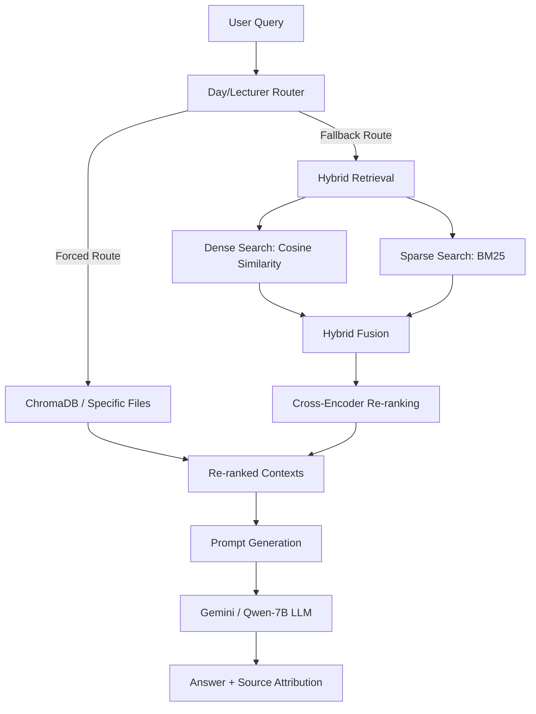

# BANASPATI Multimodal RAG (Academic Edition)

BANASPATI (Bubur Panas Personal Assistant) is a Multimodal Retrieval-Augmented Generation (RAG) system designed to answer academic queries for the Department of Information Technology at ITS Sukolilo. The system extracts, indexes, retrieves, and reasons over academic regulations, curricula, calendars, scheduling sheets, and lecturer profile directories.

## Core Features

- Multimodal Document Processing: Handles PDFs (native text) and Word Documents (.docx) containing schedules embedded as raw images.
- High-Fidelity Extraction Fallback: Extracts images directly from DOCX packages and uses Gemini Vision to transcribe them. If the cloud Vision API is rate-limited or unavailable (HTTP 503/429), it gracefully falls back to pre-transcribed schedule datasets to guarantee 100% data availability.
- Advanced Hybrid Retrieval: Combines semantic dense retrieval (SentenceTransformers) and lexical sparse retrieval (BM25) using a hybrid fusion formula (alpha=0.7 semantic dominant).
- Cross-Encoder Re-ranking: Re-ranks retrieved candidates using a cross-encoder model to maximize context precision before generating responses.
- API Rotator: Implements a model rotator class to switch between Gemini models (e.g., gemini-3.1-flash-lite, gemini-2.5-flash) in case of cloud API rate limits.
- Local SLM Integration: Supports local offline execution using Qwen-2.5-Coder-7B via Ollama, satisfying parameter constraints (< 9B parameters) and data privacy requirements.
- Rigorous Evaluation: Benchmarked using RAGAS metrics (Faithfulness, Answer Relevancy, Context Recall, Context Precision) and LLM-as-a-Judge correctness evaluations.

## Architecture and Retrieval Pipeline



1. Routing: Queries related to schedules or lecturers are dynamically routed to retrieve all schedule chunks and lecturer profiles, preventing chunk truncation.
2. Dense Retrieval: Indexes document chunks using local SentenceTransformers embeddings and performs cosine-similarity search.
3. Sparse Retrieval: Leverages Rank-BM25 to match exact keywords such as course names, SKS limits, GPA boundaries, and lecturer initials.
4. Re-ranking: Selects candidate chunks and filters them through a cross-encoder model to score the relevance of the document directly against the query.

## Performance and Evaluation

The system was evaluated against 10 representative queries containing complex conditions (e.g., magang deadlines, schedule conflicts, FRS dates, GPA-based SKS limits).

### 1. Ragas Benchmarks
- Answer Relevancy: 67.1%
- Context Recall: 65.4%
- Context Precision: 55.4%
- Faithfulness: 42.6%

### 2. LLM-as-a-Judge Benchmarks (Out of 5.0)
- Relevance: 4.90/5.00 (98%)
- Source Support: 4.50/5.00 (90%)
- Correctness: 4.10/5.00 (82%)
- Completeness: 4.10/5.00 (82%)

### 3. Cloud API vs. Local SLM (Qwen-2.5-Coder-7B) Comparison
- E2E Latency: Gemini cloud API averages 2.64s per query compared to 11.18s for the local Qwen model.
- Throughput: Gemini runs at ~149.7 tokens/sec while local Qwen runs at ~21.5 tokens/sec.
- Cost: Gemini costs approximately $0.000355 per query, while Qwen is free and runs locally.
- Data Privacy: Qwen guarantees 100% data confidentiality since no information leaves the host machine.

## Repository Structure

- banaspati_multimodal_rag.ipynb: The main Jupyter notebook containing the database creation, retrieval, evaluation, and dashboard visualization cells.
- dataset/: Directory containing the evaluation question database and academic source materials:
  - banaspati_eval_questions.csv: Evaluation questions and ground truth answers used for benchmarks.
  - Data Dosen.pdf, Jadwal Perkuliahan.docx, Kalender-Akademik-ITS-Thn-Akademik-2025-2026.pdf, Kurikulum.pdf, Nilai snbt 2025.pdf, Peraturan Akademik.pdf, Sosialisasi Magang dan Prestasi DTI.pdf, Visi Misi Departemen.pdf.
- Performance Charts: Generated PNG visualizations showing latency, correctness heatmaps, and Ollama vs. Gemini comparison metrics.


## Getting Started

1. Set up your Google AI Studio API Key:
   ```python
   # Set the GOOGLE_API_KEY environment variable or Colab secrets
   os.environ["GOOGLE_API_KEY"] = "your_api_key_here"
   ```

2. Run the notebook to initialize the ChromaDB vector store:
   - Run the setup cells to install dependencies (PyMuPDF, docx, rank_bm25, chromadb, ragas).
   - Execute the Document Processing cells. If the Gemini Vision API fails during docx extraction, the pre-extracted fallbacks will automatically transcribe the schedule pages.
   - Run the Hybrid Retrieval index building.

3. Test queries using the Demo Sandbox:
   ```python
   response = query_banaspati("Pada Jadwal Jumat, pukul 13.00-15.30, di TW2 703 terdapat mata kuliah pengayaan sebutkan nama...")
   print(response.answer)
   ```
